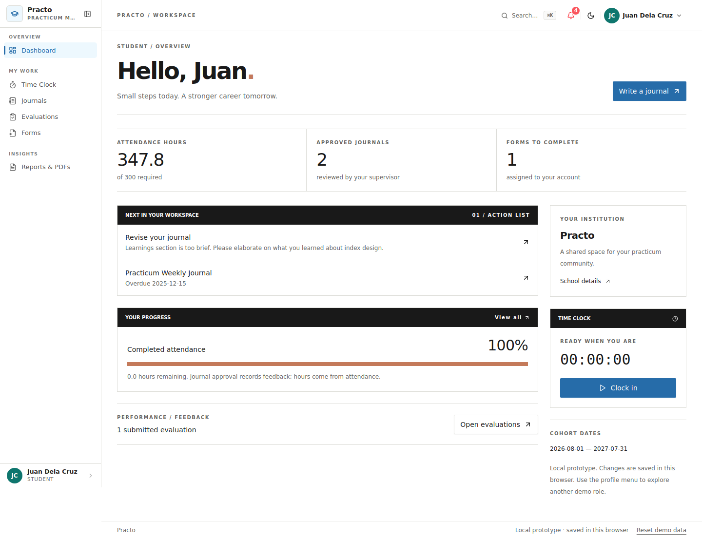
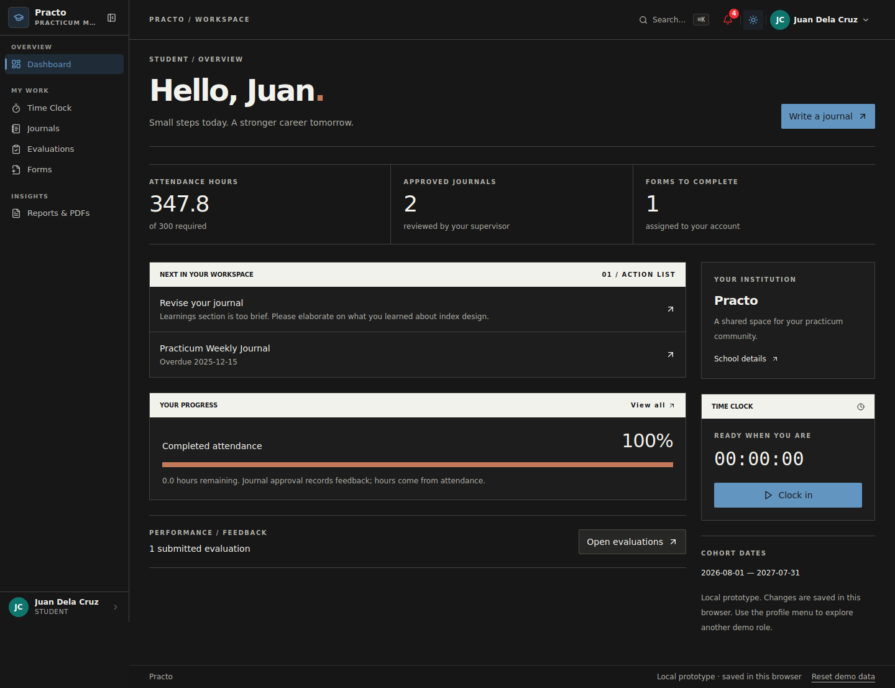

# Testing platform improvement log

Date: October 5, 2026  
Branch: `practo/testing-platform`  
Base branch: `feature/sandbox-prototype`  
Base commit: `09a4245b2941952e29f6ee10653176717dbc974e`

The work is scoped to an interactive local prototype. No merge, deployment, or modification of another branch is part of this change.

## Interface direction

The supplied editorial reference informed the hierarchy: a narrow left navigation column, a ruled central content grid, strong section bars, and a right column for institution information and focused actions. The application uses white as the default surface and charcoal as the optional dark surface. Institution colors appear as secondary accents and chart colors.

| Area | Improvement |
|---|---|
| Sign-in | Replaced the blue image carousel with an editorial brand headline, role descriptions, accessible credential fields, inline errors, explicit light/dark controls, and an expandable demo preview panel. |
| Application shell | Neutral 208px sidebar, full-width ruled action header, smaller corner radius, flat cards, clear active navigation, retained command palette, and route-parameter keyed screen mounting. |
| Dashboards | Shared editorial composition with live role-specific statistics, next actions, attendance progress, institution details, and a student's usable clock. |
| Student | Journal revisions and outstanding assigned forms appear first; evaluations and attendance are directly reachable. |
| Supervisor | Shows assigned interns, journal review queue, evaluation needs, shared forms, and cohort hours. |
| Coordinator | Shows deployment gaps, response review needs, accounts, roster progress, and timesheets. |
| Branding | School palette changes affect secondary accents/charts without turning the main sidebar or header blue. Dashboard hero upload and configured student card visibility are honored. |
| Mobile | Existing bottom navigation and drawer remain available; columns stack, long content is contained, and reset is available through the account menu. |
| Accessibility | Added current-page state, focus outlines, names for journal textareas and form action menus, labeled controls, and global reduced-motion handling. |
| Print | Hide application navigation/actions and use neutral print tokens. Custom-form PDF export offers a structured standalone document. |
| Fonts | System fonts replace build-time Google font requests. |

[Coordinator mobile capture](screenshots/coordinator-mobile.png)

## Local persistence and account behavior

- Added versioned Zustand localStorage persistence for all prototype domain collections and the current session. Hydration finishes before sign-in/workspace rendering.
- Recomputed student credited hours during hydration and restored a session only if its backing account still exists and is enabled.
- Added local storage quota feedback instead of claiming that every attempted write succeeded.
- Added a confirmed reset flow that restores demo domain data and signs out. Branding, external tool, and billing configuration remain separately persisted.
- Unified demo and newly created account lookup around live student, supervisor, and coordinator records. Updated names, emails, disabled status, and reset credentials affect sign-in immediately.
- Made personal and temporary password matching case-sensitive. New passwords require at least eight characters, an uppercase character, and a digit, and must differ from the temporary password.
- Strengthened temporary password generation using UUID randomness. This remains browser-local prototype provisioning, not production authentication.
- Added cross-role email collision checks in individual account forms, bulk creation, import previews, and central creation actions.
- Added school IDs to newly provisioned students and coordinators using the provisioning coordinator's school or the default school.
- User management exports temporary credentials only for invited accounts rather than exporting personal passwords.

## Attendance integrity

- Completed time logs are the only credited-hours source; totals are recalculated from the collection and rounded once.
- Removed the journal-approval hour increment that caused double counting and repeated-approval inflation.
- Clock-in reuses an existing active session for the same user instead of creating duplicates.
- Clock-out and attendance deletion recompute credited totals.
- Closed zero-duration records remain closed in duration/weekly selectors.
- Manual attendance checks finite dates, positive intervals, completed entries in the past, a 24-hour maximum, and interval overlap including open sessions.
- Manual input parsing uses `+08:00`; common date, time, greeting, and today selectors use `Asia/Manila`.
- Rolling-week selectors exclude sessions with future start times.
- Progress uses each student's required hours instead of the former fixed 250-hour dashboard denominator.

Historical fixtures may now show different credited totals because their attendance, rather than their formerly inconsistent `loggedHours`, drives the result. Historical journals and evaluations keep their dates. Active sessions can remain open across days; review and adjustment of stale sessions remains a future attendance-policy feature.

## Journals and evaluations

- Journal typing immediately writes a local draft; save indicators now correspond to a real write.
- Rejected journals reopen the same record, preserve supervisor notes, accept edits, and can be resubmitted.
- Approval/rejection transitions only act on pending journals. Revision requires a note.
- Starting another new journal clears the active draft reference rather than overwriting the previous draft.
- Removed claims of Google Drive sync and invented public journal sharing. Sharing copies a journal summary; linked Docs are explicitly manual links.
- Unsupported cosmetic editor formatting actions remain disabled; the journal body is plain text. DOCX export remains an actual browser download.
- Evaluation rating/comment changes immediately save a draft. A stable draft ID prevents duplicate drafts during typing/navigation.
- Submitted evaluations are immutable. Evaluation saves require the student's assigned supervisor and valid submitted ratings.
- New evaluation/form context uses the coordinator's configured cohort dates; historical report aggregates are labeled All terms.
- Unevaluated-intern selection can accept an explicit term and otherwise examines submitted evaluations across terms, matching aggregate screens.

## Custom forms

- Specific-user assignments now contain actual selected account IDs. Empty specific-recipient assignments are rejected.
- Recipients and submitter lookup use live account records, so newly provisioned accounts appear in assignment, response, and review screens.
- Response creation requires a published assigned form and a current enabled respondent. A supervisor's target student must be one of their assigned interns.
- Each response captures a form snapshot. Editing or republishing a template no longer rewrites the blocks/version displayed for an existing response.
- Existing seed responses receive snapshots during hydration.
- Form typing saves immediately using a merged value reference, preventing sibling auto-fill changes from losing earlier values.
- Required fill-in blocks and complete rating criteria are checked before submission. Signatures are required only when the block explicitly says so.
- Submitted, under-review, and approved responses cannot be edited as drafts.
- The respondent owns draft/save/submit actions. Coordinator review acts only on submitted/under-review responses and requires a note for revision requests.
- Deleting a form also deletes its assignments and responses, avoiding orphaned records.
- Replaced placeholder export toasts with actual PDF generation from the displayed form snapshot and answers; print actions invoke the browser print dialog.

These local checks improve demo correctness; they do not provide server authorization. Browser state and account credentials remain inspectable and editable by the browser user.

## Provisioning, reports, and maintenance

- Supervisor reassignment validates active status, capacity, and company compatibility, including batch additions.
- Student creation leaves invalid, disabled, full, or mismatched supervisor choices unassigned. Valid choices supply a missing company. Import results report the actual assignment.
- Imports match supervisor names/emails exactly, rather than using ambiguous partial matches; unknown named companies are created instead of silently using the first company.
- PDF types now match totals rows and column alignment. Form exports use the same centralized PDF helper; the report palette matches the neutral UI.
- CSV export protects text cells beginning with spreadsheet formula markers while preserving numeric values and ordinary CSV escaping.
- Corrected supervisor report row types, external tool property names, radar comparison data, optional display fields, and Zod 4 validation options.
- Tool URL validation requires HTTPS, rejects embedded credentials, and matches approved hostnames exactly instead of accepting lookalike hosts.
- Fixed notification destinations that pointed at nonexistent views.
- Fixed reactivity of effective school selection after school changes.
- Removed twelve unused duplicate or disconnected portal modules after checking the import graph. Active shared command palette, workspaces, reports, and navigation remain.
- Enabled strict TypeScript build checking and React Strict Mode; excluded reference examples from application type checking.
- Corrected `.env.example` to SQLite and removed the tracked machine-specific `.env`. Prisma remains optional scaffold, not a claimed Supabase integration.
- Added npm lockfile, typecheck, regression, and browser-smoke scripts. Retained the earlier Bun lockfile as baseline history; npm is the documented reproducible install path for this branch.
- Rewrote setup documentation to describe actual prototype persistence, APIs, integrations, credentials, reset behavior, and build commands.

The removed modules were `coordinator/forms-list`, `coordinator/subscription`, `layout/command-palette`, `layout/keyboard-shortcuts-help`, `layout/mobile-nav`, `shared/blur-image`, `shared/clock-widget`, `shared/weekly-goal-widget`, `student/time-clock-view`, `supervisor/supervisor-form-viewer`, `supervisor/supervisor-forms`, and `supervisor/supervisor-time-monitor`.

## Verification and explicit limits

See [VERIFICATION.md](VERIFICATION.md) for executed checks and reproduction steps, and [CHANGE_INVENTORY.md](CHANGE_INVENTORY.md) for every affected file.

Lint's inherited `react-hooks/set-state-in-effect` findings are now visible warnings scoped to source files, rather than build-blocking errors. Static-component violations were fixed. Other inherited lint exemptions were not tightened in this prototype pass. Refactoring controlled modal/editor initialization remains follow-up work; successful lint does not mean zero warnings.

## Follow-up work before production

| Priority | Work still needed | Reason |
|---|---|---|
| P0 | Real practicum schema and server-backed transactions | Browser localStorage is local demo persistence, and Prisma's User/Post scaffold is not the portal domain. |
| P0 | Server sessions, role/school ownership rules, password hashing, reset delivery, and rate limiting | Preview switching and locally stored credentials are intentionally prototype-only. |
| P0 | Make client/API use one authoritative database | Fixture GET APIs currently do not reflect browser mutations. |
| P1 | File storage, upload controls, signed downloads, and backup/restore | Images/documents should not depend on localStorage capacity in a real deployment. |
| P1 | True Google/Jibble integration or a fully native workflow decision | Links are not live sync, and third-party embeds depend on the external service. |
| P1 | Cohort/term filtering for all records, tenant isolation, and historical policy | Aggregate screens currently show all terms; configured dates drive new context, not a complete cohort engine. |
| P1 | Attendance correction approval, immutable audit events, stale session handling, and timezone sweep | Current manual attendance/deletion are local actions; not every legacy date-fns screen is standardized. |
| P1 | Broader end-to-end coverage of import, reassignment, review, and failure paths | The supplied regression/smoke suites cover the critical corrected flows but not every interaction. |
| P2 | Finish controlled-effect refactoring and replace inherited broad lint exceptions | The warning count and existing compiler-rule exemptions are explicit technical debt. |
| P2 | Rich text editing, official signatures, and report pagination/layout review | Journals are plain text and PDF/print exports are not legally signed documents. |
| P2 | Notifications delivery, real billing, subscription checks, and user agreement text | The prototype does not send email, charge money, or publish legal agreements. |
| P2 | Full responsive/accessibility audit of secondary tables, sheets, and editors | Dashboards/navigation were checked; that does not certify every legacy screen. |

No production auth, OAuth sync, real billing, deployment, branch merge, or messages to other people were performed.

## Secondary color correction — October 5, 2026

The previous neutral override made actions and selected navigation gray/black, while School Settings still previewed an obsolete fully colored sidebar. This update restores the intended hierarchy:

| Role | Light mode | Dark mode |
|---|---|---|
| Main backgrounds / cards / sidebar / header | White with neutral borders | Charcoal with neutral borders |
| School palette | Colored action buttons, active navigation text/marker, soft selection backgrounds, secondary controls, focus rings and charts | Readable lighter school action color with subtle tinted selections |
| Editorial accent | Independent dashboard progress/highlight color | Same independent accent color |

- Shared `schoolThemeCssVars` powers both the saved application palette and unsaved Live Preview. The preview uses the actual Button component and neutral sidebar surfaces rather than an old blue mockup.
- Draft palette changes update the preview and picker selection. Save applies the colors across the portal; Discard restores the saved preview. Existing browser branding persistence remains in use.
- Custom colors require full six-digit hex values. Malformed persisted custom palettes safely fall back to Azure Blue. School action colors are adjusted for legibility; the upstream preset swatches remain the original colors.
- Light/dark action text and active-selection text have a minimum computed 4.5:1 contrast against their corresponding fills. This is targeted color validation, not a full accessibility audit.
- Accent swatches now use the same `ACCENT_HEX` values as the dashboard instead of slightly different hardcoded samples, with contrast-aware checkmarks.
- School Settings descriptions and custom-color hints explain the actual color roles. Preset buttons expose their selected state with `aria-pressed`; hex fields have accessible labels.
- Desktop and mobile active navigation use the colored selection foreground; desktop section labels are easier to read.
- Added source-level palette regression coverage and browser checks for unsaved/saved preview matching, light/dark neutral surfaces, separate accents, discard, malformed custom values and persistence after reload.
- Researched six open-source options in [OPEN_SOURCE_TOOLS.md](OPEN_SOURCE_TOOLS.md), including a concrete time-service proof-of-concept plan and distinctions between core/free/paid features. Research only: no services or dependencies were added.

Changed implementation files: `src/lib/school-themes.ts`, `src/app/globals.css`, `src/components/portal/layout/sidebar.tsx`, and `src/components/portal/settings/school-identity-settings.tsx`. Updated both existing test suites, README, verification and change inventory. Refreshed dashboard/mobile captures and added light/dark School Settings captures under `docs/screenshots/`.

Publication review: removed the README demo credential table after automatic approval review rejected redistributing account emails/initial passwords. Demo preview access remains available.
